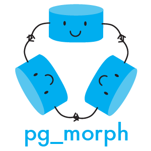

# PgMorph
# 

PgMorph gives you a way to handle DB consistency for polymorphic relations and is based on postgreSQL inheritance and partitioning features.

## Installation

Add this line to your application's Gemfile:

```ruby
gem 'pg_morph'
```

And then execute:

```console
$ bundle
```

Or install it yourself as:

```console
$ gem install pg_morph
```

## Usage

Let's say you have a `Like` class and it's in polymorphic relation with `Post` and `Comment` classes. You can't add foreign keys for those relations, and there's where PgMorph comes.

By adding migration:

```ruby
add_polymorphic_foreign_key :likes, :comments, column: :likeable
```

PgMorph creates a partition table named `likes_comments` which inherits from `likes` table, sets foreign key on it and redirects all inserts to `likes` to this partition table if `likeable_type` is `Like`. It's done by using before insert trigger.

You will have to add polymorphic foreign key on all related tables and each time new relation is added, before insert trigger function will be updated to reflect all defined relations and redirect new records to proper partitions.

From the Rails point of view it's totally transparent, so all inserts, updates and selections work as they were on original `likes` table.

You can remove polymorphic foreign keys with below migration:

```ruby
remove_polymorphic_foreign_key :likes, :comments, column: :likeable
```

Because it means that whole partition table would be removed, you will be forbidden to do that if partition table contains any data.

## Issues

ActiveRecord uses `INSERT ... RETURNING id` query which was impossible to keep while while using regular tables without some trick. In ideal situation there should be inly one insert to partition table, omitting main table, but than `id` of newly created record would become `nil` which would frustrate most of us. To preserve `id` of new record main table is not omitted, two records are being made and in after insert trigger duplicated record from master table is removed.

## Development plan

To avoid extra database operations with deleting duplicated records view of main table is going to be used. Possibly at the beginning it won't be as transparent for ActiveRecord as it is now, but this change is important from the point of view of database optimization.

## Contributing

1. Fork it
2. Create your feature branch (`git checkout -b my-new-feature`)
3. Commit your changes (`git commit -am 'Add some feature'`)
4. Push to the branch (`git push origin my-new-feature`)
5. Create new Pull Request
